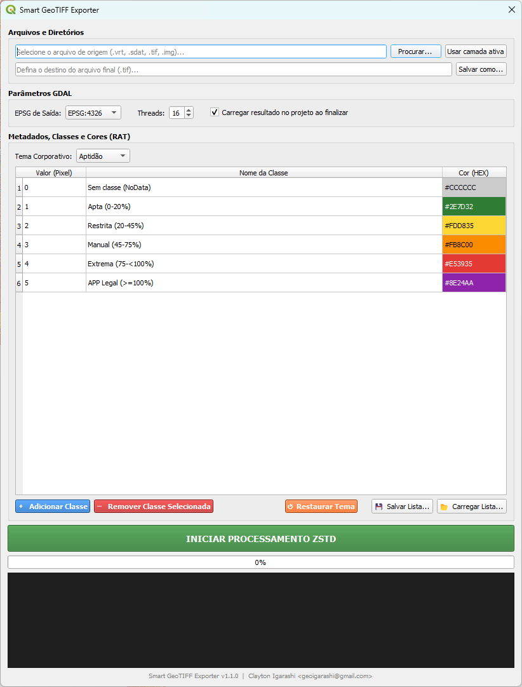
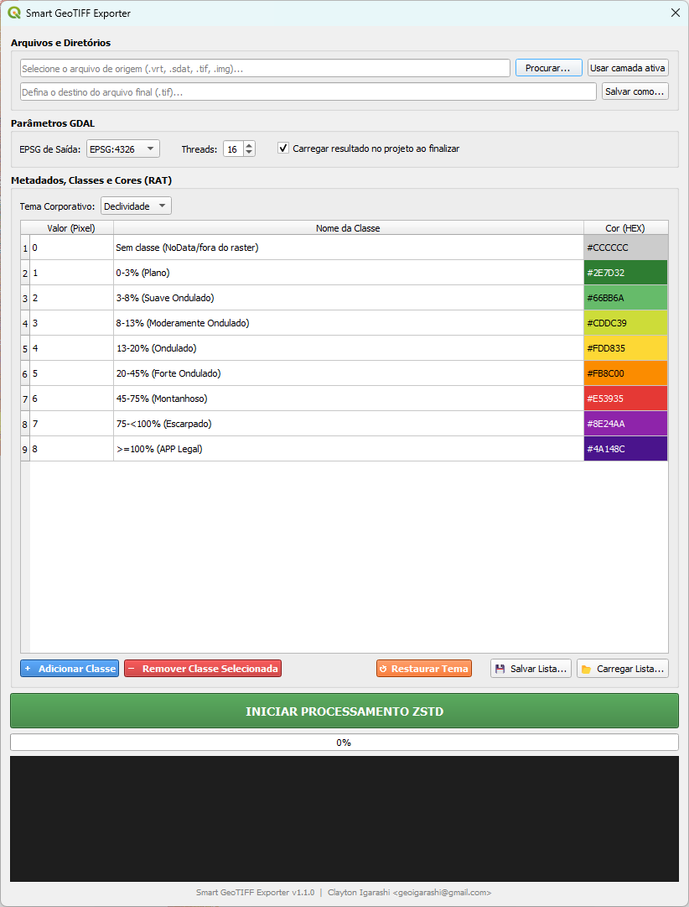
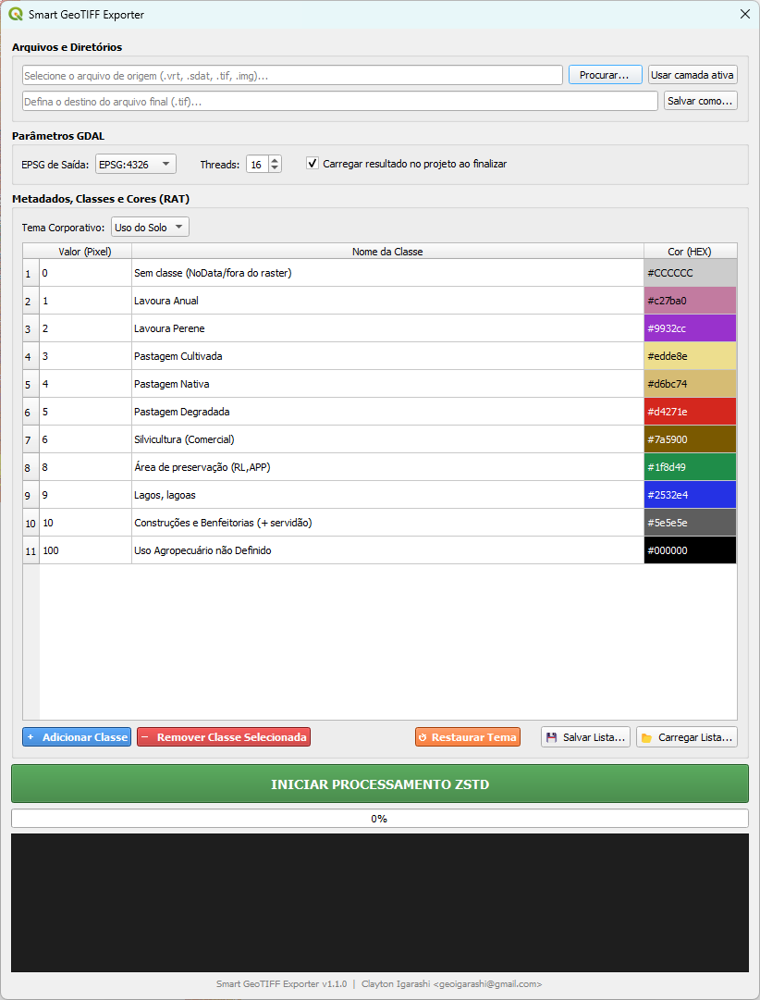

# Smart GeoTIFF Exporter

> Plugin QGIS para exportação corporativa de rasters com compressão **ZSTD**, pirâmides automáticas, paleta de cores configurável e geração de estilo **QML** pronto para uso.

[](https://qgis.org)
[](https://python.org)
[](https://gdal.org)
[](LICENSE)

---

## Sumário

- [Sobre o Plugin](#sobre-o-plugin)
- [Funcionalidades](#funcionalidades)
- [Screenshots](#screenshots)
- [Requisitos](#requisitos)
- [Instalação](#instalação)
- [Como usar](#como-usar)
- [Estrutura do Projeto](#estrutura-do-projeto)
- [Autor](#autor)

---

## Sobre o Plugin

O **Smart GeoTIFF Exporter** nasceu da necessidade de padronizar e acelerar a exportação de rasters classificados (Aptidão, Declividade, Uso do Solo) em um fluxo corporativo de geoprocessamento.

Ele encapsula em uma única interface dentro do QGIS todo o pipeline que antes exigia linha de comando ou scripts externos:

1. **Conversão e compressão** para GeoTIFF tileado com ZSTD
2. **Geração de overviews** (pirâmides) com resampling NEAREST
3. **Injeção de metadados** via Raster Attribute Table (RAT) esparsa
4. **Paleta de cores corporativa** com visualização imediata na tabela
5. **Geração automática do arquivo `.qml`** de estilo para QGIS
6. **Carregamento direto** da camada processada no projeto

---

## Funcionalidades

- Temas corporativos pré-definidos: **Aptidão**, **Declividade** e **Uso do Solo**
- **Tabela de classes totalmente editável**: adicione, remova e edite qualquer célula — incluindo a coluna **Valor (Pixel)** — com validação automática de duplicatas
- **Salvar/Carregar listas de classes** em `.json` para reutilização em projetos futuros
- **Importação de paleta a partir de `.qml`** do QGIS — reaproveite estilos já criados no projeto diretamente na tabela RAT
- **Botão "Usar camada ativa"**: importa o caminho da camada selecionada no projeto sem navegar pelo sistema de arquivos
- **Checkbox de carregamento automático**: ao finalizar, a camada exportada entra direto no mapa com estilo aplicado
- Suporte a múltiplos sistemas de referência: EPSG:4326, 4674, 31982, 31983, 31984
- Controle de **threads** de processamento (1–32)
- **Log em tempo real** com painel de console integrado
- **Barra de progresso** dupla (conversão + overviews)
- Processamento em `QThread` separada — a interface do QGIS não trava durante a operação

---

## Screenshots

### Tema: Aptidão


### Tema: Declividade


### Tema: Uso do Solo


---

## Requisitos

| Dependência | Versão mínima | Observação |
|---|---|---|
| QGIS | 3.16 | Já inclui PyQt5 e GDAL |
| GDAL | 3.x | Nativo do QGIS — suporte a driver ZSTD necessário |
| Python | 3.x | Nativo do QGIS |

> **Nota:** Nenhuma instalação de pacotes externos é necessária. Todas as dependências (`PyQt5`, `osgeo/GDAL`) já fazem parte da instalação padrão do QGIS 3.16+.

---

## Instalação

### Pelo Gerenciador de Plugins (recomendado)

1. Baixe o arquivo `smart_geotiff_exporter.zip` na página de [Releases](../../releases)
2. No QGIS: **Plugins → Gerenciar e Instalar Plugins → Instalar a partir de ZIP**
3. Selecione o `.zip` baixado e clique em **Instalar Plugin**
4. O plugin estará disponível em: **Raster → Smart GeoTIFF Exporter**

### Manual (via repositório)

```bash
# Clone o repositório
git clone https://github.com/geoigarashi/smart_geotiff_exporter.git

# Copie a pasta do plugin para o diretório de plugins do QGIS
# Windows:
xcopy smart_geotiff_exporter "%APPDATA%\QGIS\QGIS3\profiles\default\python\plugins\" /E /I

# Linux / macOS:
cp -r smart_geotiff_exporter ~/.local/share/QGIS/QGIS3/profiles/default/python/plugins/
```

Após copiar, reinicie o QGIS e ative o plugin em **Plugins → Gerenciar e Instalar Plugins**.

---

## Como usar

### Passo a passo básico

1. Abra o plugin em **Raster → Smart GeoTIFF Exporter** (ou pelo botão na toolbar)
2. **Arquivo de origem:** clique em `Procurar...` para selecionar um arquivo raster (`.vrt`, `.sdat`, `.tif`, `.img`) — ou clique em `Usar camada ativa` para usar a camada selecionada no projeto
3. **Arquivo de destino:** clique em `Salvar como...` e defina o caminho do GeoTIFF de saída
4. Selecione o **EPSG de saída** e o número de **Threads**
5. Escolha o **Tema Corporativo** ou personalize a tabela de classes (adicione/remova/edite linhas)
6. Clique em **INICIAR PROCESSAMENTO ZSTD**
7. Acompanhe o progresso no painel de log e na barra de progresso

### Saídas geradas

Para cada processamento, dois arquivos são criados:

| Arquivo | Descrição |
|---|---|
| `nome_arquivo.tif` | GeoTIFF comprimido com ZSTD, tileado, com RAT e paleta de cores |
| `nome_arquivo.qml` | Estilo de simbologia paletizada pronto para uso no QGIS |

Se a opção **"Carregar resultado no projeto"** estiver marcada, a camada é carregada automaticamente com o estilo `.qml` já aplicado.

### Personalização de classes

É possível editar a tabela de classes livremente antes de processar:

- **Editar** qualquer célula — incluindo a coluna **Valor (Pixel)** — diretamente na tabela; valores inválidos ou duplicados são rejeitados com aviso e revertidos automaticamente
- **Adicionar linha** para inserir uma nova classe personalizada
- **Remover linha** para excluir uma classe que não existe no raster
- **💾 Salvar Lista...** — exporta as classes atuais para um arquivo `.json` reutilizável em processamentos futuros
- **📂 Carregar Lista...** — importa classes a partir de:
  - `.json` salvo anteriormente pelo plugin
  - `.qml` do QGIS (renderer *paletted*) — ideal para reaproveitar estilos já existentes no projeto

Isso permite usar o plugin com qualquer raster classificado, sem se limitar aos temas pré-definidos.

---

## Estrutura do Projeto

```
smart_geotiff_exporter/
├── __init__.py                         # Ponto de entrada do QGIS
├── metadata.txt                        # Metadados do plugin
├── icon.png                            # Ícone da toolbar
├── smart_geotiff_exporter.py           # Registro do menu e toolbar
├── smart_geotiff_exporter_dialog.py    # Interface gráfica + GdalWorker (QThread)
├── README.md                           # Esta documentação
└── docs/
    └── screenshots/
        ├── screenshot_1.png
        ├── screenshot_2.png
        └── screenshot_3.png
```

---

## Autor

**Clayton Igarashi**
📧 [geoigarashi@gmail.com](mailto:geoigarashi@gmail.com)
🐙 [github.com/geoigarashi](https://github.com/geoigarashi)

---

*Plugin desenvolvido para fluxos corporativos de geoprocessamento raster com padronização de metadados e estilo QGIS.*
